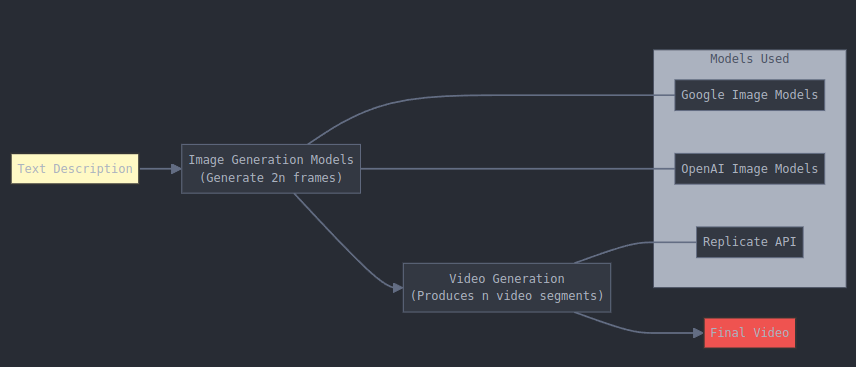
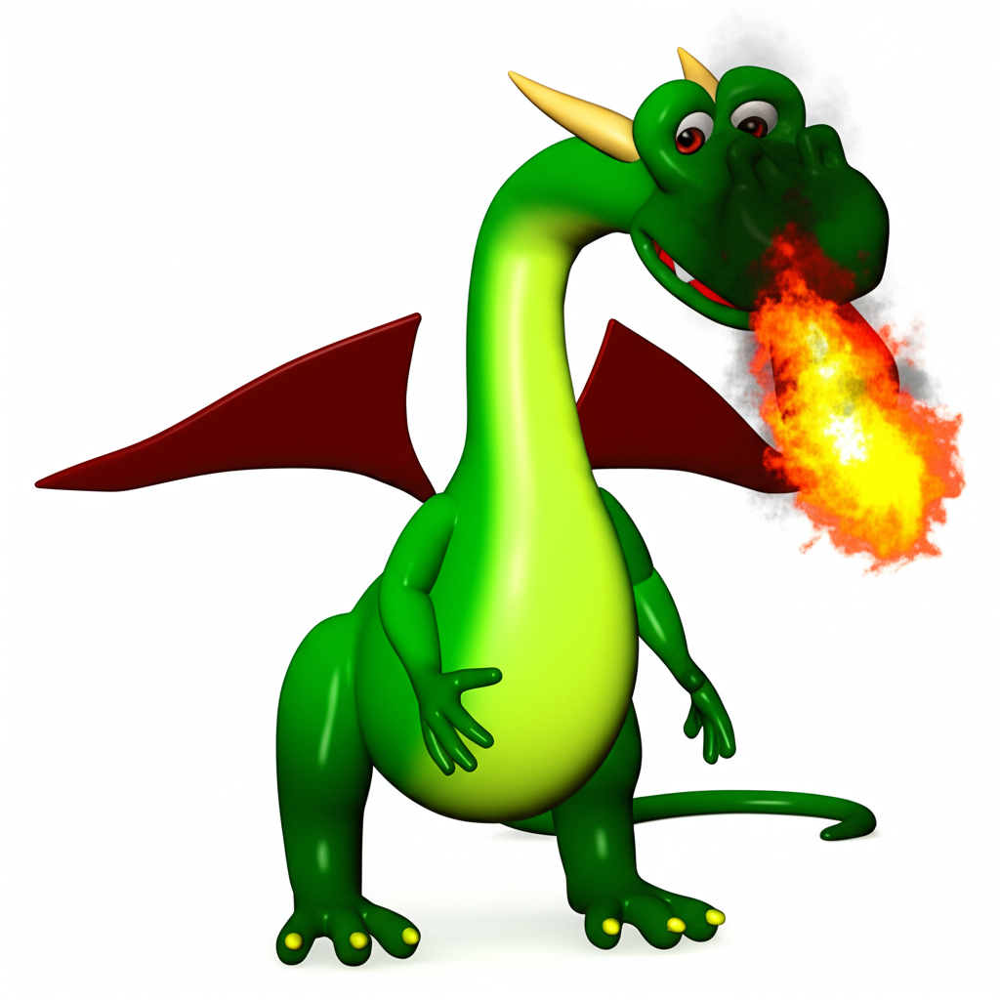

## Text 2 Video Workflow

We will create text 2 video workflow here

In short goign direclty from text to videos is hard, it hard to control each aspect of the video and to ensure consistency in videos and what fidelity with what we want, we will approach it as two step problem
1. Create Discription of video what we want to AI. (Discription of video and how long it should be). It will generate a detail plan. Iterate over this plan to make sure you are satisfied with the plan and details of objects.
2. Use VLM ideally native text image model like geminin flash thinking to generate key points of the videos. 
3. Use keyframes/text to Video model to join short videos based on either one key frame or ideally two key frames describing end and start of short video clips
4. Get all the clips and join them.
5. Add audio to those clips, this will be added here in the future right now you can join the videos and add free audio from youtube or from speech to text models.
6. [Optionally] add subtitles to Video

## Text2Video

Text2Video is a project that explores using multimodal LLMs to generate videos from text descriptions.

The process works in three steps:

1. Key Frames Generation
   - Uses state-of-the-art image generation models from Google and OpenAI
   - Generates high-quality key frames based on the text description

2. Video Generation
   - Takes the generated key frames as input
   - Uses modern video generation models via Replicate's API
   - Produces smooth video transitions between frames

3. Video Editing
   - Uses video editing models to join clips and add audio to the video
   - Produces a final video

Note: While we use Replicate for convenient API access to video generation models, this is a paid service. You can alternatively self-host these models or use other providers.

  

#### A short 5 sec example

<table align="center">
  <tr>
    <td></td>
    <td></td>
    <td>➡️</td>
    <td></td>
  </tr>
  <tr>
    <td align="center">Frame 1</td>
    <td align="center">Frame 2</td>
    <td></td>
    <td align="center"><a href="text2Videos/assets/dragon.mp4" target="_blank">Click to watch video</a></td>
  </tr>
</table>

we will demonstrate this workflow to create youtube shorts. shorts are right candidate for this workflow since text/Image to video models can only generate videos of small duration in high quality due to high computational requirements and in turn cost. We will be using replicate to use I/T 2 Video models for now but we can expand this to out serving or some other servings of these models.

